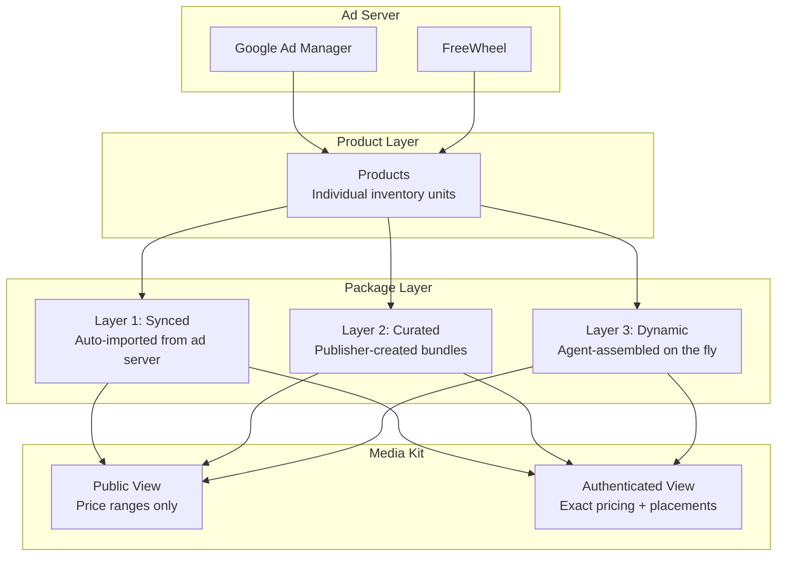
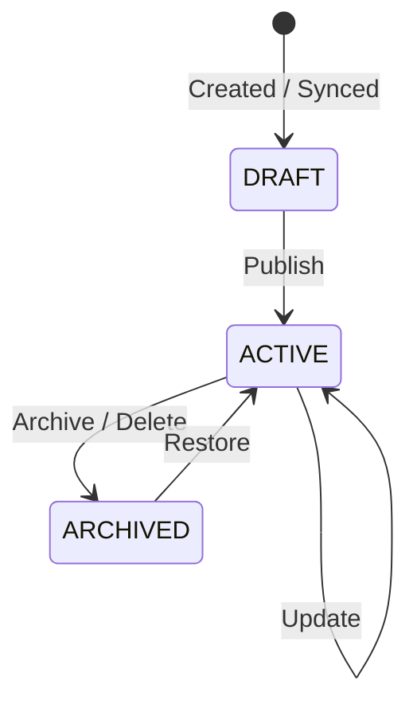

# Media Kit Setup

The media kit is the seller agent's **inventory catalog** — a curated discovery layer that lets buyer agents browse your available ad inventory. It sits on top of your raw products and presents them as browseable, searchable packages with tier-gated pricing.

## How It Works



## Three Package Layers

### Layer 1: Synced (Ad Server Import)

Packages are auto-created when you sync inventory from Google Ad Manager (or FreeWheel). The sync classifies each ad unit by inventory type and generates packages with blended pricing.

```bash
# Trigger an inventory sync
curl -X POST http://localhost:8001/packages/sync
```

See [Inventory Sync](inventory-sync.md) for GAM connection setup and classification rules.

### Layer 2: Curated (Publisher-Created)

Manually create branded packages that bundle specific products with custom pricing, targeting, and metadata.

```bash
curl -X POST http://localhost:8001/packages \
  -H "Content-Type: application/json" \
  -d '{
    "name": "Sports Premium Video",
    "description": "Live sports and highlights across CTV and mobile",
    "product_ids": ["prod-video-001", "prod-ctv-002"],
    "cat": ["IAB19", "IAB19-29"],
    "audience_segment_ids": ["3", "4", "5"],
    "device_types": [3, 4, 5],
    "ad_formats": ["video"],
    "geo_targets": ["US"],
    "base_price": 42.00,
    "floor_price": 29.40,
    "tags": ["premium", "sports", "live events"],
    "is_featured": true,
    "seasonal_label": "NFL Season 2024"
  }'
```

**Key fields:**

| Field | Format | Example |
|-------|--------|---------|
| `cat` | IAB Content Taxonomy v2/v3 IDs | `["IAB19", "IAB19-29"]` |
| `audience_segment_ids` | IAB Audience Taxonomy 1.1 IDs | `["3", "4", "5"]` |
| `device_types` | AdCOM DeviceType integers | `[3, 7]` (CTV, STB) |
| `ad_formats` | OpenRTB format names | `["video", "banner"]` |
| `geo_targets` | ISO 3166-2 codes | `["US", "US-NY"]` |
| `tags` | Human-readable search terms | `["premium", "sports"]` |

### Layer 3: Dynamic (Agent-Assembled)

Buyer or seller agents can assemble custom packages on the fly from product IDs. The system computes blended pricing and merges inventory characteristics automatically.

```bash
curl -X POST http://localhost:8001/packages/assemble \
  -H "Content-Type: application/json" \
  -d '{
    "name": "Custom CTV + Mobile Bundle",
    "product_ids": ["prod-ctv-001", "prod-mobile-002", "prod-video-003"]
  }'
```

Dynamic packages are persisted for reference but are typically ephemeral — created during a negotiation session.

## Tier-Gated Access

The media kit shows different levels of detail depending on the buyer's authentication status and access tier.

### What Buyers See

| Data Field | Public (No Auth) | Seat (API Key) | Agency | Advertiser |
|-----------|:---:|:---:|:---:|:---:|
| Package name & description | Yes | Yes | Yes | Yes |
| Ad formats, device types | Yes | Yes | Yes | Yes |
| Content categories (`cat`) | Yes | Yes | Yes | Yes |
| Geo targets | Yes | Yes | Yes | Yes |
| Tags, featured status | Yes | Yes | Yes | Yes |
| **Price range** (e.g. "$28–$42 CPM") | Yes | — | — | — |
| **Exact tier-adjusted price** | — | Yes | Yes | Yes |
| **Floor price** | — | Yes | Yes | Yes |
| **Placements** (product details) | — | Yes | Yes | Yes |
| **Audience segment IDs** | — | Yes | Yes | Yes |
| **Negotiation enabled** | — | — | Yes | Yes |
| **Volume discounts available** | — | — | — | Yes |

### Pricing by Tier

Authenticated buyers receive tier-adjusted pricing. The discount comes from the [Pricing & Access Tiers](pricing-rules.md) configuration:

| Tier | Discount | Example ($35 base) |
|------|----------|-------------------|
| PUBLIC | 0% | "$28–$42 CPM" (range only) |
| SEAT | 5% | $33.25 CPM |
| AGENCY | 10% | $31.50 CPM |
| ADVERTISER | 15% | $29.75 CPM |

## Public Endpoints (No Auth Required)

These are the endpoints buyer agents use to browse your media kit without authentication:

| Method | Path | Description |
|--------|------|-------------|
| `GET` | `/media-kit` | Overview: seller name, featured packages, all packages |
| `GET` | `/media-kit/packages` | List packages (filter by `layer`, `featured_only`) |
| `GET` | `/media-kit/packages/{id}` | Single package (public view) |
| `POST` | `/media-kit/search` | Keyword search across packages |

### Media Kit Overview

```bash
curl http://localhost:8001/media-kit
```

Response:

```json
{
  "seller_name": "Premium Publisher Network",
  "total_packages": 12,
  "featured": [
    {
      "package_id": "pkg-abc12345",
      "name": "Sports Premium Video",
      "description": "Live sports and highlights",
      "ad_formats": ["video"],
      "device_types": [3, 4, 5],
      "cat": ["IAB19"],
      "price_range": "$28-$42 CPM",
      "is_featured": true
    }
  ],
  "all_packages": [...]
}
```

### Search Packages

```bash
curl -X POST http://localhost:8001/media-kit/search \
  -H "Content-Type: application/json" \
  -d '{"query": "sports video"}'
```

Search matches against package name, description, tags, content categories, and ad formats. Featured packages receive a 1.5x score boost.

## Authenticated Endpoints (API Key Required)

These endpoints require an `X-API-Key` header and return richer data including exact pricing and placement details:

| Method | Path | Description |
|--------|------|-------------|
| `GET` | `/packages` | List with tier-gated views |
| `GET` | `/packages/{id}` | Single package with exact pricing |
| `POST` | `/packages` | Create curated package (Layer 2) |
| `PUT` | `/packages/{id}` | Update package |
| `DELETE` | `/packages/{id}` | Archive package (soft delete) |
| `POST` | `/packages/assemble` | Assemble dynamic package (Layer 3) |
| `POST` | `/packages/sync` | Trigger ad server inventory sync |

### Authenticated Package Response

```bash
curl http://localhost:8001/packages/pkg-abc12345 \
  -H "X-API-Key: buyer-key-123"
```

```json
{
  "package_id": "pkg-abc12345",
  "name": "Sports Premium Video",
  "ad_formats": ["video"],
  "device_types": [3, 4, 5],
  "cat": ["IAB19", "IAB19-29"],
  "price_range": "$33 CPM",
  "exact_price": 33.25,
  "floor_price": 29.40,
  "currency": "USD",
  "placements": [
    {
      "product_id": "prod-video-001",
      "product_name": "Live Sports Video - CTV",
      "ad_formats": ["video"],
      "device_types": [3, 7],
      "weight": 1.0
    },
    {
      "product_id": "prod-video-002",
      "product_name": "Sports Highlights - Mobile",
      "ad_formats": ["video"],
      "device_types": [4, 5],
      "weight": 1.0
    }
  ],
  "audience_segment_ids": ["3", "4", "5"],
  "negotiation_enabled": true,
  "volume_discounts_available": false
}
```

## Managing Your Media Kit

### Recommended Workflow

1. **Sync inventory** from your ad server to create Layer 1 packages:
   ```bash
   curl -X POST http://localhost:8001/packages/sync
   ```

2. **Review synced packages** — they start as DRAFT:
   ```bash
   curl http://localhost:8001/packages?layer=synced
   ```

3. **Create curated packages** for premium bundles you want to feature:
   ```bash
   curl -X POST http://localhost:8001/packages \
     -H "Content-Type: application/json" \
     -d '{"name": "...", "product_ids": [...], "is_featured": true}'
   ```

4. **Mark packages as featured** to highlight them in the media kit overview:
   ```bash
   curl -X PUT http://localhost:8001/packages/pkg-12345 \
     -H "Content-Type: application/json" \
     -d '{"is_featured": true, "seasonal_label": "Holiday 2024"}'
   ```

5. **Archive outdated packages** (soft delete):
   ```bash
   curl -X DELETE http://localhost:8001/packages/pkg-old-123
   ```

### Package Lifecycle



### MCP Tool Access

Agents can also manage the media kit via MCP tool calls:

| Tool | Description |
|------|-------------|
| `search_inventory` | Search and browse available packages |
| `get_product_catalog` | List all products and packages |

## Taxonomy Reference

All taxonomy fields use IAB standard identifiers as canonical values:

| Field | Standard | Examples |
|-------|----------|----------|
| `cat` | IAB Content Taxonomy v2/v3 | `IAB1` (Arts), `IAB19` (Sports), `IAB19-29` (Football) |
| `cattax` | Taxonomy version | `1` = CT1.0, `2` = CT2.0, `3` = CT3.0 |
| `audience_segment_ids` | IAB Audience Taxonomy 1.1 | Numeric IDs (`"3"`, `"4"`, `"5"`) |
| `device_types` | AdCOM DeviceType | `1`=Mobile, `2`=PC, `3`=CTV, `4`=Phone, `5`=Tablet, `6`=Connected, `7`=STB |
| `ad_formats` | OpenRTB | `"banner"`, `"video"`, `"native"`, `"audio"` |
| `geo_targets` | ISO 3166-2 | `"US"`, `"US-NY"`, `"US-CA"` |
| `currency` | ISO 4217 | `"USD"`, `"EUR"`, `"GBP"` |

## Next Steps

- [Pricing & Access Tiers](pricing-rules.md) — Configure tier discounts and negotiation rules
- [Inventory Sync](inventory-sync.md) — Connect your ad server for Layer 1 packages
- [Buyer & Agent Management](agent-management.md) — Issue API keys so buyers see authenticated views
