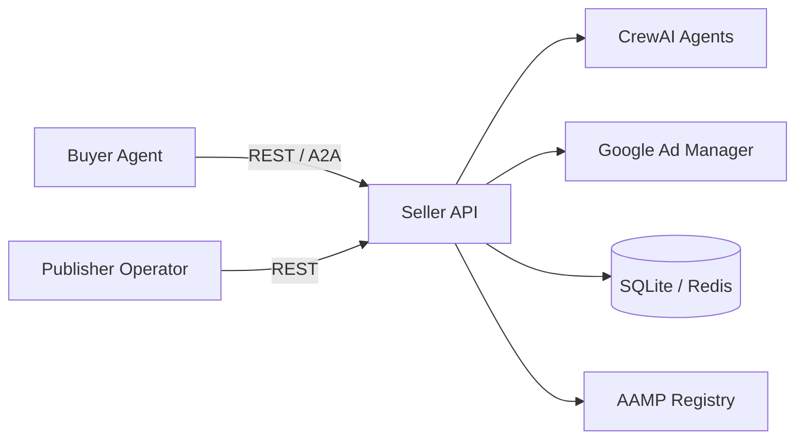

# Publisher Setup Guide

Step-by-step guide for publishers deploying the IAB Tech Lab Seller Agent.

## Setup Checklist

1. [Configuration & Environment](configuration.md) -- Set env vars, connect your ad server
2. [Inventory Sync](inventory-sync.md) -- Connect GAM/FreeWheel, sync your inventory
3. [Media Kit](media-kit.md) -- Set up your inventory catalog with packages, tiers, and featured items
4. [Pricing & Access Tiers](pricing-rules.md) -- Configure buyer pricing tiers, discounts, negotiation limits
5. [Approval & Human-in-the-Loop](approval-rules.md) -- Set up approval gates for deals
6. [Buyer & Agent Management](agent-management.md) -- Manage API keys, agent trust, buyer access

## Current Status

!!! info "Alpha Release"
    The seller agent is in active development. Some configuration is done via
    environment variables and code-level defaults rather than runtime APIs.
    This guide documents what works today and notes planned improvements.

## Prerequisites

Before starting, ensure you have:

- **Python 3.11+** installed
- An **Anthropic API key** (`ANTHROPIC_API_KEY`) for the LLM-powered specialist agents
- (Optional) A **Google Ad Manager** network code and service account key for live inventory sync
- (Optional) A public URL for agent discovery if participating in the IAB AAMP ecosystem

## Architecture Overview

The seller agent runs as a FastAPI service that exposes:

- **REST API** for buyer agents and operators
- **MCP** and **A2A** protocol interfaces for agent-to-agent communication
- **OpenDirect 2.1** compliance for deal lifecycle management
- **Human-in-the-loop** approval gates for operator oversight

